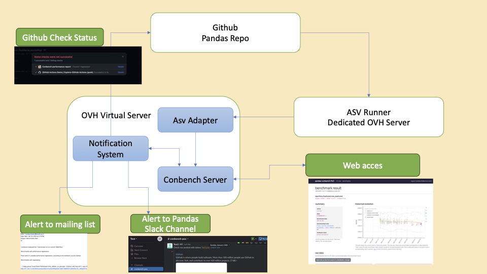

# Conbench PoC for pandas

The **purpose** of adding conbench to the current pandas benchmark system 
is:
1. To improve the UI.
2. Use conbench statistical analysis and detection of regression/improvement
3. Add an automatic alert system for  regressions or improvements.

## Files description
**client.py:** Calls the adapter asvbench.py and posts to a conbench web app.  
**asvbench.py:** Converts asv's benchmarks results to conbench format.  
**alert.py:** Runs conbench alert pipeline, generates a report and sends alerts.  
**benchmark_email.py:** Handles the email.  
**utilities.py:** setup env variables, reads files.  
**setup_server.txt:** Steps to install this PoC.  

## PoC structure/setup
